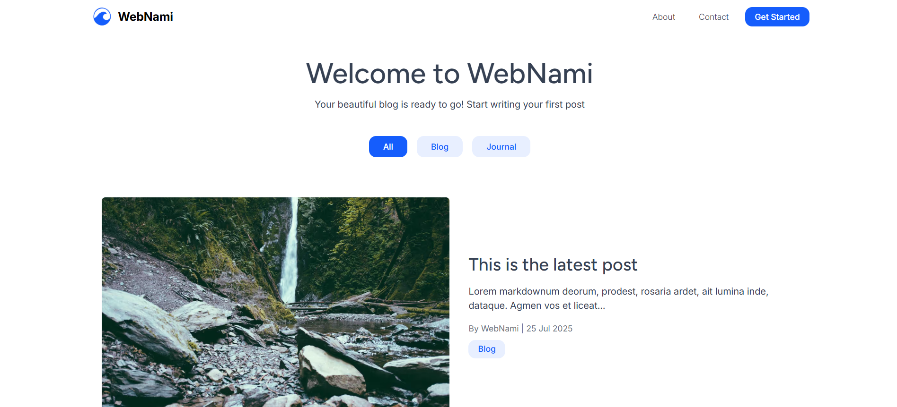

<p align="center"></p>

<h1 align="center">WebNami</h1>

<p align="center">
🚀 <b>The fastest way to launch a modern, SEO-optimized blog with 11ty.</b><br/>
100/100 Lighthouse scores, built-in SEO audits, and ready-to-deploy in minutes.
</p>

<p align="center">
  <a href="https://webnami-blog.pages.dev/" target="_blank">🌐 Live Demo</a> •
</p>

<p align="center">
  
  
  
  
</p>



---

## 📝 Project Overview

**WebNami** is an open source, SEO-focused blogging website generator built with [11ty (Eleventy)](https://www.11ty.dev/). It is designed for anyone who wants to create a fast, modern, and highly customizable blog with minimal setup. WebNami is ideal for developers, writers, and teams who value performance, accessibility, and clean design.

---

## ✨ Features

- ⚡ **Lightning Fast:** Built with 11ty for optimal performance and instant page loads.
- 🔍 **SEO Audit:** On-page SEO errors are displayed in the console during build, so you can fix issues before deploying.
- 📊 **Perfect Performance:** Achieves 100/100 on Core Web Vitals for speed, accessibility, and best practices.
- 📡 **RSS Feed:** Automatic RSS feed generation for easy syndication.
- 🗺️ **Sitemap:** Auto-generated XML sitemap for better search engine indexing.
- 🤖 **Robots.txt:** SEO-friendly robots.txt included by default.
- 🚫 **Custom 404 Page:** Beautiful error page for a better user experience.
- 🔗 **Canonical Links:** Proper canonical URL management to avoid duplicate content.
- 📱 **Meta Tags:** Complete title, description, and Open Graph tags for social sharing.
- 💻 **Syntax Highlighting:** Built-in code syntax highlighting.
- 📋 **Structured Data Markup:** Rich snippets and structured data for enhanced SEO and search engine visibility.
- 🌙 **Dark/Light Theme:** Toggle between dark and light modes with automatic system preference detection.
- 🎨 **Minimal Design:** Clean, beautiful, and fully responsive design out of the box.

---

## 📸 Screenshots

- **SEO Audit in Terminal:**

  
  <br/><sub>SEO issues and warnings are displayed in the terminal during build.</sub>

- **Core Web Vitals (Lighthouse):**

  
  <br/><sub>WebNami achieves perfect scores on Core Web Vitals.</sub>

---

## 🗂️ Project Structure

```
webnami/
├── config.js                # Main configuration file
├── package.json             # Project metadata and dependencies
├── custom.css               # Main CSS file for custom styles
├── images/                  # Image assets
├── pages/                   # Static pages (about, contact, etc.) [Markdown only]
├── posts/                   # Blog posts [Markdown only]
├── src/                     # Source code (templates, assets, system pages, etc.)
├── _site/                   # Generated output (do not edit directly)
└── README.md                # Project documentation
```

- **pages/**: Only Markdown files for static pages (e.g., about, contact)
- **posts/**: Only Markdown files for blog posts
- **images/**: Store your image assets here
- **custom.css**: Use this file for all your custom styles
- **\_site/**: This is the build output folder (generated automatically)

---

## 🛠️ How to Use

### Pages Folder

- Add static pages (like About, Contact) in `pages/` as Markdown (`.md`) files only.
- Example: `pages/about.md`

### Posts Folder

- Create blog posts in `posts/` using Markdown (`.md`) files only.
- Each post must start with frontmatter. See [Frontmatter Reference](#frontmatter-reference) for details.

### custom.css

- Customize your site's look by editing `custom.css` in the project root.
- Override colors for both light and dark themes (primary, background, content, accent, and footer colors)

---

## 🏷️ Frontmatter Reference

Both pages and posts require frontmatter at the top of each Markdown file. Here are the required fields and their explanations:

### For Pages (e.g., About, Contact)

```markdown
---
metadata:
  title: "Sample Page Title"
  description: "This is a sample description for the page."
  img: "https://example.com/sample-image.png"
permalink: "/sample-page/"
---
```

- **metadata.title**: The page title (required)
- **metadata.description**: Short description for SEO and meta tags (recommended)
- **metadata.img**: Image for and meta tags (recommended)
- **permalink**: The URL path for the page (required)

### For Posts

```markdown
---
metadata:
  title: "Sample Blog Post Title"
  description: "This is a sample summary for the blog post."
heading: "Sample Heading for the Blog Post"
img: "https://example.com/sample-image.png"
imgAlt: "Sample image alt text"
tags: ["SampleTag1", "SampleTag2"]
category: "SampleCategory"
author: "Sample Author"
date: 2024-07-25
---
```

- **metadata.title**: The post title (required)
- **metadata.description**: Short summary for SEO and meta tags (recommended)
- **heading**: Main heading for the post (displayed on the post page)
- **img**: Main image URL for the post (used in previews and social sharing)
- **imgAlt**: Alt text for the main image (accessibility and SEO)
- **tags**: List of tags for the post (optional, used for tag pages)
- **category**: Category name (optional, used for category pages)
- **author**: Author name (optional)
- **date**: Publish date in YYYY-MM-DD format (required)

---

## ⚙️ Configuration (config.js)

The `config.js` file controls your site's settings. Here is an explanation of the main fields:

- **site**: Core site information
  - `name`: The name of your site
  - `url`: The base URL for your site
  - `language`: The language code for your site (e.g., "en")
  - `csp`: Content Security Policy (CSP) settings
    - `enabled`: Set to `true` to enable CSP headers for your site, or `false` to disable them.
    - `policy`: The CSP policy string. This defines the allowed sources for content on your site.
- **branding**: Visual identity settings
  - `favicon`: Path to your favicon
  - `logo`: Object with `src` (image path) and `alt` (alt text)
- **listings**: Settings for listing/archive pages
  - `pagination.postsPerPage`: Number of posts per page
  - `postPreview.showAuthorInListing`: Show author in post previews
  - `postPreview.showDateInListing`: Show date in post previews
  - `postPreview.showCategoryInListing`: Show category in post previews
  - `postPreview.showExcerptInListing`: Show excerpt in post previews
- **pages**: Page-specific settings
  - `homepage`: Settings for the homepage
    - `showHeading`: Show the main heading
    - `centerHeading`: Center the heading text
    - `heading`: Homepage heading text
    - `subheading`: Homepage subtitle
    - `showCategoryNavigation`: Show category navigation
    - `metadata.title`: Title for SEO/meta tags
    - `metadata.description`: Description for SEO/meta tags
    - `metadata.image`: Social sharing image URL
- **navbar**: Navigation bar links
  - `links`: Array of navigation links (each with `name`, `href`, and optional `cta` for call-to-action)
- **footer**: Footer configuration
  - `socialLinks`: Array of social media links (each with `name` and `href`)
  - `linkGroups`: Array of grouped footer links (each with `title`, `displayGroupTitle`, and `links`)

---

## 🚀 Getting Started

### Prerequisites

- **Node.js** v20 or higher
- **npm** v10 or higher (or use `yarn`/`pnpm`)

### Installation

#### Option 1: Using npx (Recommended)

```bash
npx create-webnami-blog my-blog-name
cd my-blog-name
```

#### Option 2: Using npm

```bash
npm create webnami-blog my-blog-name
cd my-blog-name
```

#### Option 3: Manual Clone

```bash
mkdir my-blog-name
cd my-blog-name
git clone https://github.com/webnami-dev/webnami.git .
npm install
```

### Initial Configuration

- Edit `config.js` to set your site name, URL, and other settings.
- Add your logo and favicon to the `images/` directory.

### First Run

```bash
npm run dev
```

Visit [http://localhost:8080](http://localhost:8080) to see your site.

> **Note:** If you used Option 1 or 2 above, dependencies are automatically installed. Only Option 3 (manual clone) requires running `npm install` separately.

---

## ⌨️ Commands

- **Build for production:**

  ```bash
  npm run build
  ```

  Generates the static site in the `_site/` directory.

- **Start development server:**

  ```bash
  npm run dev
  ```

  Runs a local server with hot reload.

- **Other utility commands:**
  - Add your own scripts in `package.json` as needed.

---

## 🐞 Troubleshooting

- **Build fails:** Make sure you have the correct Node.js and npm version.
- **SEO warnings:** Review console output during build for SEO issues.
- **Images not showing:** Confirm image paths in `config.js`, posts, and pages.

If you run into issues, check the [GitHub Issues](https://github.com/webnami/webnami/issues) page.

---

## ⚡ Performance

- WebNami is optimized for speed and SEO.
- Achieves 100/100 on Core Web Vitals in Lighthouse.
- Minimal JavaScript and CSS for fast load times.

---

## ⭐ Star History

[](https://www.star-history.com/#webnami-dev/webnami&Timeline)

---

## 📬 Contact & Support

- **Email:** hello.webnami@gmail.com
- **Report Issues:** [GitHub Issues](https://github.com/webnami-dev/webnami/issues)

---

**WebNami** — The modern, fast, and SEO-friendly way to blog.
